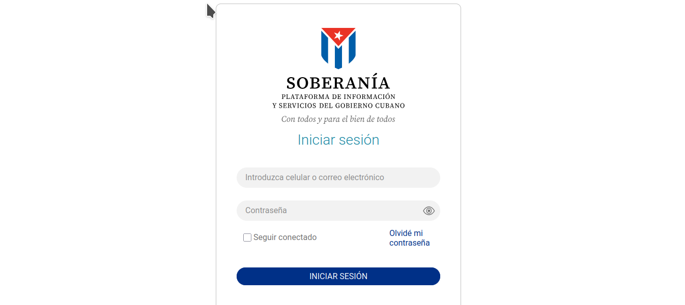

# eid-soberania-mock

[](https://opensource.org/licenses/ISC)
[](https://reactjs.org/)
[](https://nestjs.com/)
[](https://www.typescriptlang.org/)

Partial imitation of Cuba's ["Soberanía"](https://eid.soberania.gob.cu/realms/CUBA/protocol/openid-connect/auth?client_id=portal-public&redirect_uri=https%3A%2F%2Fmiperfil.soberania.gob.cu%2Fcertificacion-de-cuenta%2Finformacion&response_mode=fragment&response_type=code&scope=openid) authentication platform for OAuth testing



## Features
- OAuth 2.0 authentication flow simulation (the original system uses OpenID-Connect)
- User registration and credential management
- Client application integration
- Mock identity provider for testing
- Responsive UI inspired by Cuba's eID system

## Tech Stack
- **Frontend**: React 19 + Vite + TypeScript
- **Backend**: NestJS + TypeScript
- **Package Manager**: pnpm
- **Testing**: Jest (unit/e2e)

## Quick Start

### Prerequisites
- Node.js 18+
- pnpm 8+

### Installation
```bash
# Clone repository
git clone https://github.com/rodnye/eid-soberania-mock.git
cd eid-soberania-mock

# Install dependencies
pnpm install
```

### Development
```bash
# start both frontend and backend
pnpm dev
```

### Production
```bash
# build for production
pnpm build

# start production server
pnpm start
```

## Project Structure
```
├── backend/          # NestJS server
│   ├── src/
│   │   ├── auth/     # Authentication middleware
│   │   ├── oauth/    # OAuth controllers
│   │   └── users/    # User management
├── frontend/         # React client
│   ├── src/
│   │   ├── components/  # Reusable UI components
│   │   └── pages/      # Authentication flow pages
└── scripts/          # Build utilities
```

## License
This project is licensed under the ISC License - see the [LICENSE](LICENSE) file for details.

---

**Note**: This is a mock implementation for testing purposes only. Not affiliated with official Cuban eID systems.